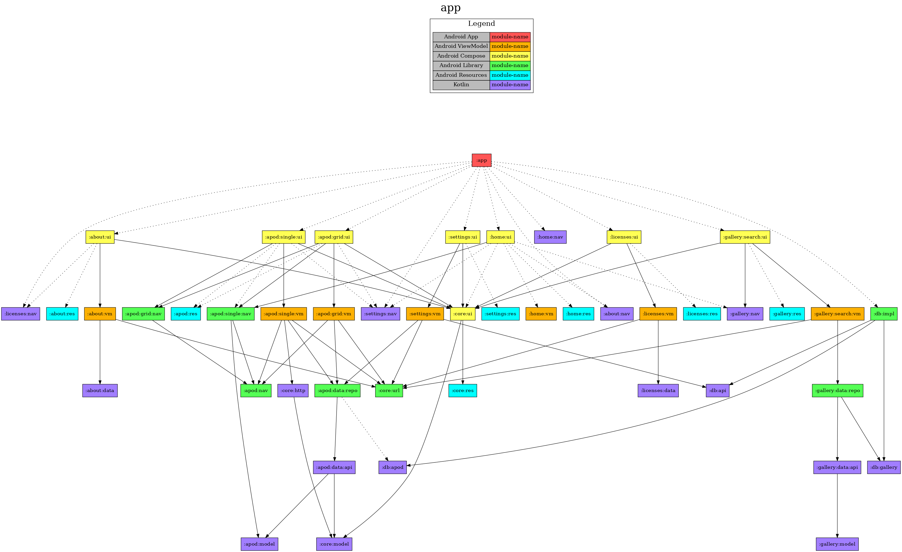

<h1 align="center">NASA Android</h1>

<p align="center">
  <a href="https://opensource.org/licenses/Apache-2.0"></a>
  <a href="https://android-arsenal.com/api?level=24"></a>
  <a href="https://github.com/jonapoul/nasa-android"></a>
  <a href="https://github.com/jonapoul/nasa-android"></a>
</p>

# Summary

A demo app for viewing NASA's open Astronomy Photo Of The Day (APOD) service on an Android device.

The regular APOD can be viewed on the web at https://apod.nasa.gov/apod/astropix.html, for reference. This project makes use of the NASA open APIs, documented over here: https://api.nasa.gov/.

The app pulls metadata about each image from the APOD service, then caches that data in a SQLite database on the phone. It then downloads and cache the images locally. You can also:
- Open the image in full-screen view and zoom/pan around
- Navigate backwards/forwards in time between posts
- Load a random post from the entire archive
- Load the post from a specific date
- Display a month's posts in a grid format for viewing thumbnails
- Change the app's theme between light, dark or midnight
- Clear the app's image/metadata cache for testing purposes

# Screenshots

## Home page

| Light Theme | Dark Theme | Midnight Theme |
|--|--|--|
|  |  |  |

## Other screens

| Grid display | Settings | About |
|--|--|--|
|  |  |  |

# Building

## JDK
This project uses JDK 21 - so make sure you have this installed and selected in your IDE settings before building. I personally used the Zulu variant, but ideally there shouldn't be any practical difference.

## Command Line
Open in Android Studio and run:
```sh
./gradlew app:assembleRelease
```

The APK will be dumped in `app/build/outputs/apk/release`, relative to the project root.

## API Key
Open https://api.nasa.gov/ in a web browser and register for an API key. Once you've got one, place it in a `local.properties` file in the root of the project directory like:

```properties
# not a real key...
nasa.apiKey=yUJkwoyIRswfwR19MEVyfJ5JIwEjBEBoYOx2WqnC

## Alternatively, use the DEMO_KEY made available by NASA to test services. Be aware that it will be heavily
## restricted in how many requests the app will be able to make. See https://api.nasa.gov/#demo_key-rate-limits
#nasa.apiKey=DEMO_KEY
```

If you like, you can omit this property entirely and just enter the API key at runtime - the app will prompt you do to this if none has been saved.

## Keystore

Optionally, if you want to sign the built APK with a custom keystore, add some extra properties in `local.properties` like below:

```properties
nasa.keyFile=relative/path/to/keystore.jks
nasa.keyFilePassword=password-of-keystore-file
nasa.keyAlias=key-alias
nasa.keyPassword=password-of-key
```

The APK will still build (unsigned) if these properties are omitted.

# Download

Go to the [releases page](https://github.com/jonapoul/nasa-android/releases) to download the latest APK.

# Module Structure

In the diagram below:
- Dotted line = `implementation`
- Solid line = `api`

Different types of module have been coloured to indicate their rough function. In this project I've separated the UI layer from the associated screen's ViewModel, as well as the various data layer components. This allows different Gradle build configs to be applied to each as required.

See the diagrams in each submodule's README to view the web of modules underneath it.



# Libraries

This project uses (amongst others):

| Name                  | Purpose                      |
|-----------------------|------------------------------|
| Jetpack Compose       | UI framework                 |
| AndroidX Navigation   | Screen navigation in Compose |
| Retrofit + OkHttp     | HTTP API requests            |
| kotlinx-serialization | JSON serialization           |
| Room                  | SQLite databases             |
| Timber                | Logging                      |
| Coil                  | Image loading                |
| Hilt                  | Dependency injection         |
| Turbine               | Testing flows                |
| JUnit 4               | Testing                      |
| MockK                 | Testing                      |

See the [libs.versions.toml](gradle/libs.versions.toml) file for a full listing, or the Licenses screen in-app (accessible via the About screen).

# License

```
Copyright 2024 Jon Poulton

Licensed under the Apache License, Version 2.0 (the "License");
you may not use this file except in compliance with the License.
You may obtain a copy of the License at

   http://www.apache.org/licenses/LICENSE-2.0

Unless required by applicable law or agreed to in writing, software
distributed under the License is distributed on an "AS IS" BASIS,
WITHOUT WARRANTIES OR CONDITIONS OF ANY KIND, either express or implied.
See the License for the specific language governing permissions and
limitations under the License.
```
