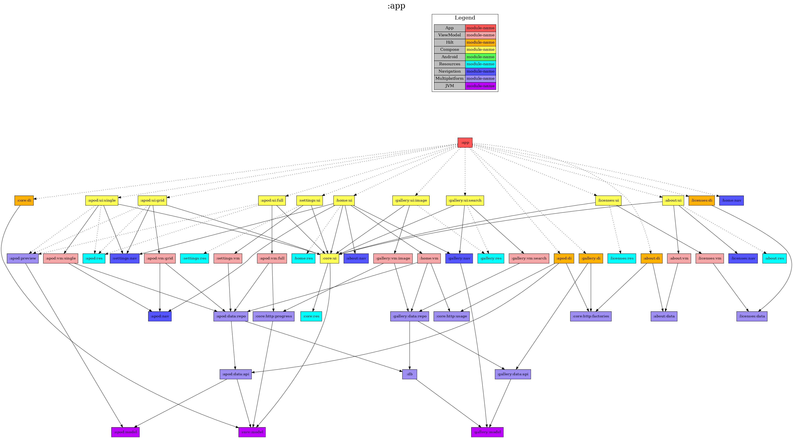

<h1 align="center">NASA Astronomy Photo Of The Day (APOD)</h1>

<p align="center">
  <a href="https://opensource.org/licenses/Apache-2.0"></a>
  <a href="https://android-arsenal.com/api?level=24"></a>
  <a href="https://github.com/jonapoul/apod-android"></a>
  <a href="https://github.com/jonapoul/apod-android"></a>
</p>

# Summary

A demo app for viewing NASA's open Astronomy Photo Of The Day (APOD) service on an Android device.

The regular APOD can be viewed on the web at https://apod.nasa.gov/apod/astropix.html, for reference. This project makes use of the NASA open APIs, documented over here: https://api.nasa.gov/

# Screenshots

TODO

# Building

## Command Line
Open in Android Studio and run:
```sh
./gradlew app:assembleRelease
```
The APK will be dumped in

## API Key
Open https://api.nasa.gov/ in a web browser and register for an API key. Once you've got one, place it in a `local-api.properties` file in the root of the project directory like:

```properties
nasaApiKey=MY_API_KEY
```

Alternatively, you can omit this property and just enter the API key at runtime. The key will be saved in the app's preferences.

If you like, you can try it out without registering at all by using NASA's `DEMO_KEY` - this gives you a very rate-limited access to the API for demo purposes. See https://api.nasa.gov/#demo_key-rate-limits for more info.

## Keystore

Optionally, if you want to sign the built APK with a custom keystore, add some extra properties in `local-keystore.properties` like below:

```properties
keyFile=relative/path/to/keystore.jks
keyFilePassword=password-of-keystore-file
keyAlias=key-alias
keyPassword=password-of-key
```

The APK will still build (unsigned) if these properties are omitted.

# Download

Go to the [releases page](https://github.com/jonapoul/apod-android/releases) to download the latest APK.

# Module Structure

- Dotted line = `implementation`
- Solid line = `api`



# License

```
Copyright 2024 Jon Poulton

Licensed under the Apache License, Version 2.0 (the "License");
you may not use this file except in compliance with the License.
You may obtain a copy of the License at

   http://www.apache.org/licenses/LICENSE-2.0

Unless required by applicable law or agreed to in writing, software
distributed under the License is distributed on an "AS IS" BASIS,
WITHOUT WARRANTIES OR CONDITIONS OF ANY KIND, either express or implied.
See the License for the specific language governing permissions and
limitations under the License.
```
